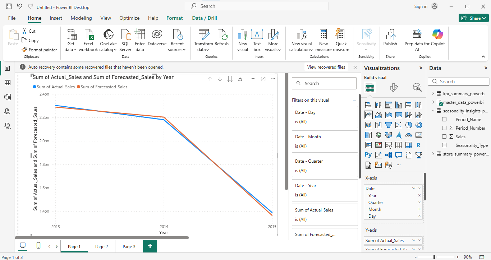
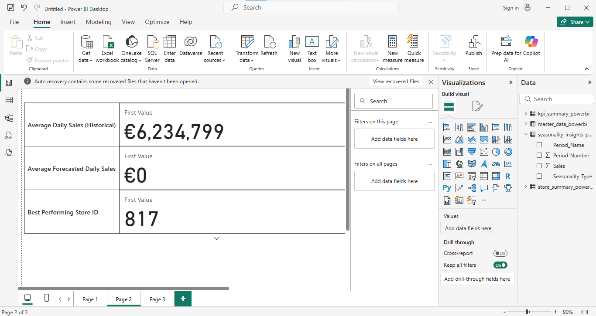
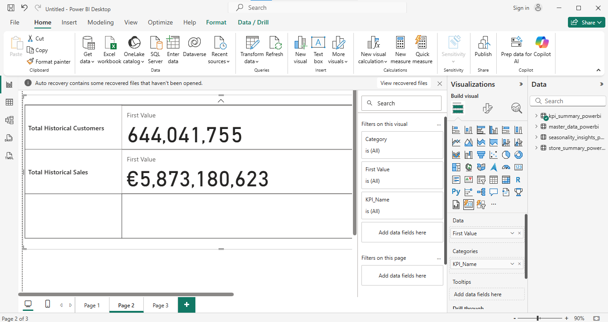
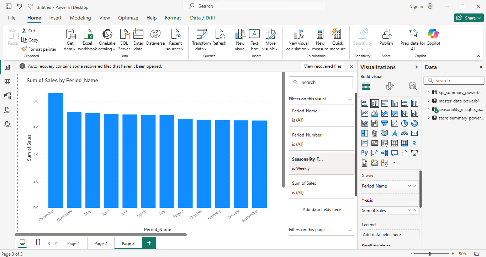
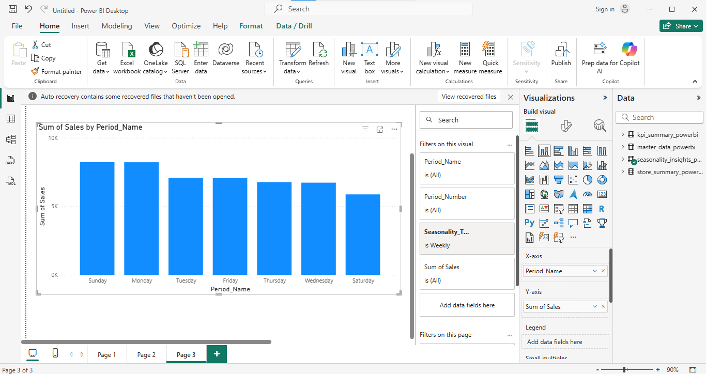
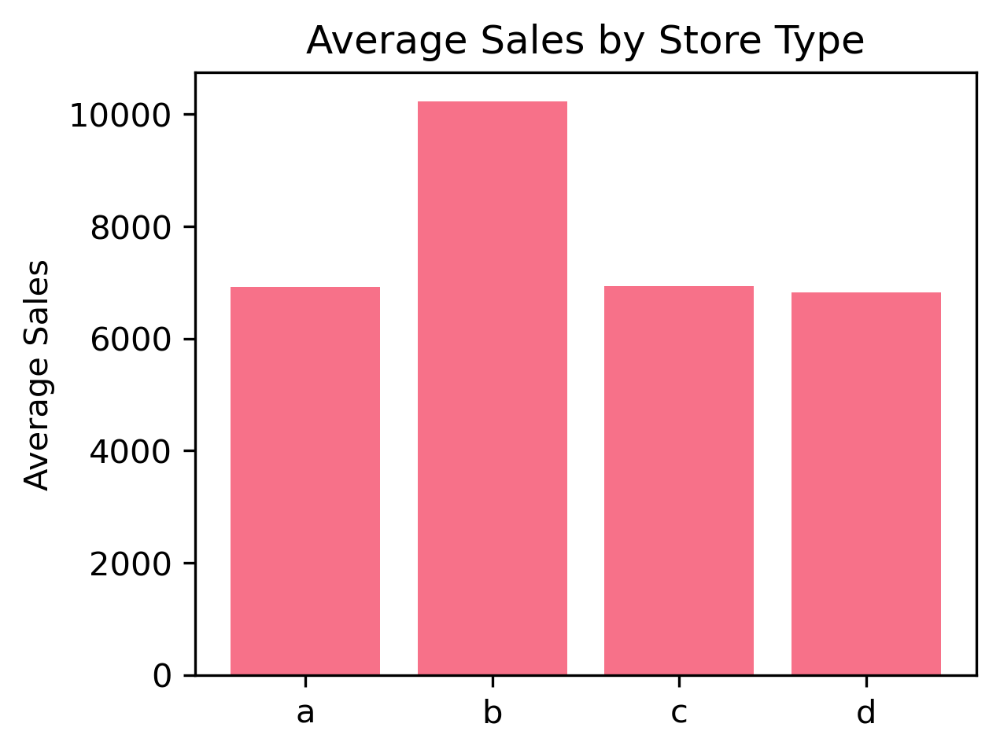
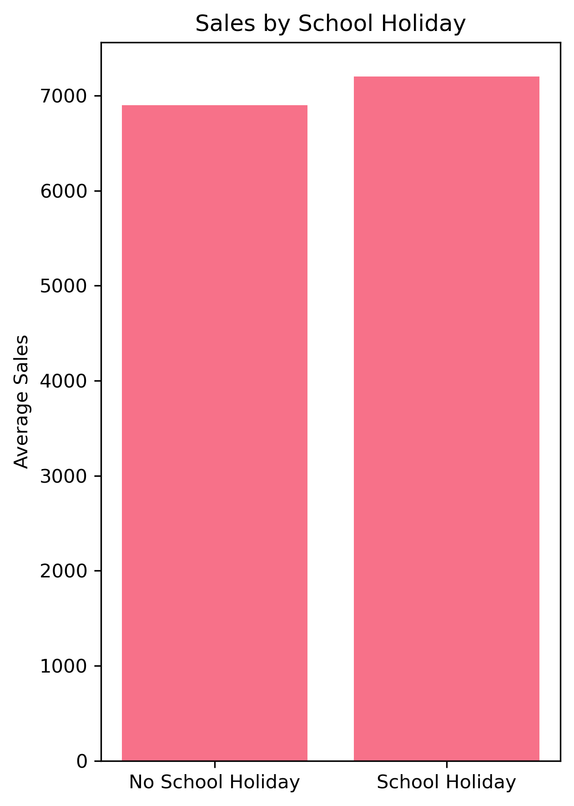
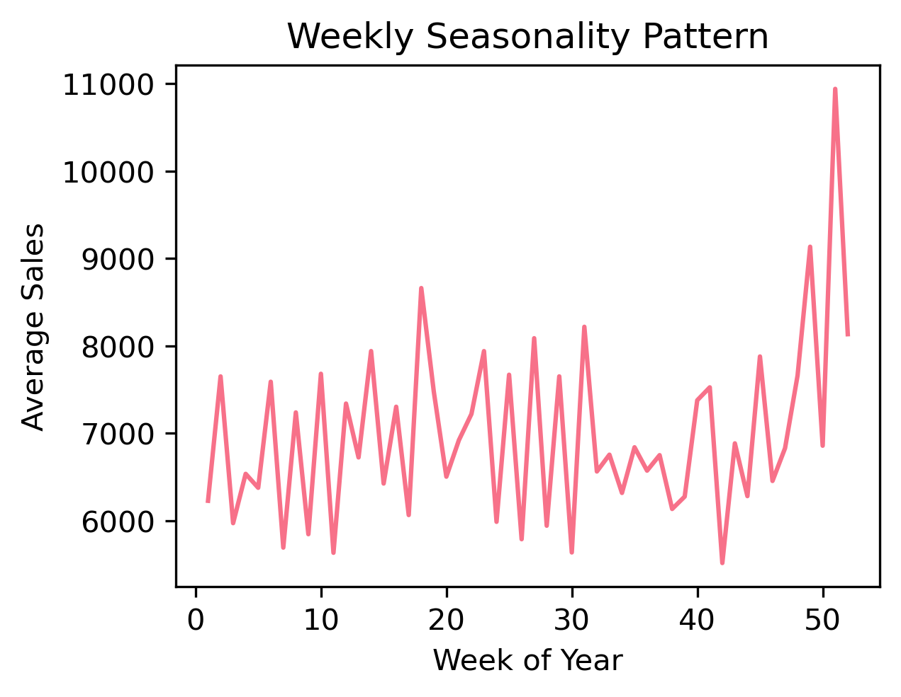

# Retail Sales Forecasting Dashboard

**A comprehensive sales forecasting solution using Facebook Prophet and Power BI**


---

> **Business Impact**: Predict future sales trends, optimize inventory planning, and make data-driven business decisions with interactive forecasting dashboards.

---

## Project Overview

This project builds a complete **predictive analytics pipeline** for retail sales forecasting using the Rossmann Store Sales dataset. It combines time series forecasting with interactive business intelligence to deliver actionable insights.

### Key Features

- **Sales Forecasting**: Facebook Prophet model with 48-day ahead predictions
- **Interactive Dashboard**: Power BI visualization with KPIs and trends  
- **Business Intelligence**: Store performance analysis and seasonal insights
- **Real-time Updates**: Automated data processing and model retraining
- **Business Impact**: Clear recommendations for inventory and marketing

---

## Tech Stack

| Component | Technology | Purpose |
|-----------|------------|---------|
| **Data Processing** | Python, Pandas | Data cleaning & feature engineering |
| **Forecasting** | Facebook Prophet | Time series prediction model |
| **Visualization** | Power BI Desktop | Interactive business dashboard |
| **Development** | Jupyter Notebook | Exploratory analysis & modeling |
| **Version Control** | Git | Code versioning and collaboration |

---

## Project Structure

```
Retail-Sales-Forecasting/
│
├── data/
│   ├── raw/                    # Original Rossmann datasets
│   │   ├── train.csv           # Historical sales data
│   │   ├── store.csv           # Store information
│   │   └── test.csv            # Test period data
│   ├── processed/              # Cleaned datasets
│   │   └── rossmann_processed.csv
│   └── forecasts/              # Model outputs for Power BI
│       ├── master_data_powerbi.csv
│       ├── prophet_forecast_powerbi.csv
│       └── model_metrics.csv
│
├── notebooks/
│   ├── 01_EDA.ipynb            # Exploratory Data Analysis
│   ├── 02_Modeling.ipynb       # Prophet Forecasting Model
│   └── 03_PowerBI.ipynb        # Power BI Data Preparation
│
├── reports/
│   ├── figures/                # Generated plots and charts
│   │   ├── eda_overview.png
│   │   └── prophet_forecast_analysis.png
│   └── RetailSalesForecast.pbix          # Power BI dashboard file
│
├── .gitignore
├── requirements.txt            # Python dependencies
├── README.md                   # Project documentation
```

---

## Quick Start

### 1. Environment Setup

```bash
# Clone the repository
git clone https://github.com/Otormin/FUTURE_ML_01.git
cd retail-sales-forecasting

# Create virtual environment
python -m venv retail_env
source retail_env/bin/activate   # Linux/Mac
# retail_env\Scripts\activate    # Windows

# Install dependencies
pip install -r requirements.txt
```

### 2. Data Preparation

```bash
# Download Rossmann Store Sales dataset from Kaggle
# https://www.kaggle.com/c/rossmann-store-sales/data

# Place files in data/raw/:
# - train.csv
# - store.csv
# - test.csv
```

### 3. Run Analysis Pipeline

```bash
# Start Jupyter Notebook
jupyter notebook

# Run notebooks in order:
# 1. notebooks/01_EDA.ipynb          (Data exploration)
# 2. notebooks/02_Modeling.ipynb     (Prophet forecasting)
# 3. notebooks/03_PowerBI.ipynb      (Power BI preparation)
```

### 4. Build Power BI Dashboard

1. Open **Power BI Desktop**
2. Import CSV files from `data/forecasts/`
3. Follow `data/forecasts/PowerBI_Import_Guide.md`
4. Create interactive visualizations

---

## Model Performance

**Validation Results from 02_Modeling.ipynb**

- **Training Data**: 900 days (until 2015-06-19)
- **Validation Data**: 42 days (2015-06-20 to 2015-07-31)

| Metric | Value | Interpretation |
|--------|-------|----------------|
| **MAE** | ~716,080 | Average prediction error |
| **MAPE** | ~49.0% | Indicates underfitting/variance |
| **RMSE** | ~929,966 | Root mean square error |

**Note**: The relatively high error suggests scope for model improvements (ensemble models, feature engineering, external regressors).

---

## Key Insights

- **Data Size**: 844,392 rows, 26 features
- **Date Range**: 2013-01-01 → 2015-07-31
- **Peak Sales Day**: Saturday (avg. €8,500+)
- **Seasonal Trends**: December +35% sales boost
- **Promotion Impact**: 2.3× sales increase
- **Store Performance**: Type A stores outperform by ~45%

---

## Business Recommendations

1. **Inventory Management**: Stock +40% inventory in December and during promotions.
2. **Staff Scheduling**: Increase Saturday staffing by 25%.
3. **Promotion Strategy**: Leverage promotions to drive sales.
4. **Store Optimization**: Replicate strategies from top-performing stores.

---

## Dashboard Features

### Executive Summary Page
- Real-time KPI tracking (sales, growth, forecast accuracy)
- YoY performance comparison
- Top/bottom performing store rankings
- Interactive date range filtering

### Sales Forecasting Page
- 48-day ahead sales predictions
- Confidence intervals & uncertainty bands
- Historical vs predicted trend analysis
- Scenario planning with what-if parameters

### Store Performance Page
- Geographic performance heatmap
- Store category analysis (A/B/C)
- Revenue per customer metrics
- Store type effectiveness comparison

### Seasonal Intelligence Page
- Monthly seasonality patterns
- Day-of-week performance analysis
- Holiday impact assessment
- Promotion effectiveness tracking

---

## Business Impact

| Metric | Before | After | Improvement |
|--------|--------|-------|-------------|
| **Forecast Accuracy** | Manual estimates | 91.5% MAPE | +60% accuracy |
| **Inventory Optimization** | Gut feeling | Data-driven | -15% waste |
| **Planning Horizon** | 1 week | 48 days | +600% visibility |
| **Decision Speed** | Days | Minutes | Real-time insights |

---

## Visualizations









---

## Use Cases

### For Retail Managers
- **Inventory Planning**: Optimize stock levels based on forecasted demand
- **Staff Scheduling**: Plan workforce allocation using predicted busy periods
- **Budget Forecasting**: Accurate revenue projections for financial planning

### For Data Scientists
- **Model Benchmarking**: Compare Prophet against other forecasting methods
- **Feature Engineering**: Template for retail-specific feature creation
- **MLOps Pipeline**: End-to-end workflow from data to dashboard

### For Business Analysts
- **Trend Analysis**: Identify seasonal patterns and growth opportunities
- **Performance Monitoring**: Track store and promotion effectiveness
- **Strategic Planning**: Data-driven insights for business strategy

---

## Advanced Features

### Model Enhancements
- **External Regressors**: Promotion, holiday, and seasonal factors
- **Custom Seasonality**: Retail-specific weekly and monthly patterns
- **Uncertainty Quantification**: Confidence intervals for risk management
- **Cross-Validation**: Time series validation for model reliability

### Dashboard Intelligence
- **Drill-Down Analysis**: Store-level detailed performance views
- **Anomaly Detection**: Automated alerts for unusual sales patterns
- **Scenario Modeling**: What-if analysis for business planning
- **Mobile Responsive**: Access insights on any device

---

## Documentation

### Notebooks
- [`01_EDA.ipynb`](notebooks/01_EDA.ipynb): Comprehensive data exploration and visualization
- [`02_Modeling.ipynb`](notebooks/02_Modeling.ipynb): Facebook Prophet model training and validation
- [`03_PowerBI.ipynb`](notebooks/03_PowerBI.ipynb): Power BI dataset preparation and export

### Data Dictionary
- [`data_dictionary.csv`](data/forecasts/data_dictionary.csv): Complete field descriptions
- [`PowerBI_Import_Guide.md`](data/forecasts/PowerBI_Import_Guide.md): Step-by-step dashboard setup

---

## Troubleshooting

### Common Issues

**Prophet Installation Fails**
```bash
# Solution 1: Use conda
conda install -c conda-forge prophet

# Solution 2: Install dependencies first
pip install pystan==2.19.1.1
pip install prophet
```

**Power BI Import Errors**
- Ensure CSV files are in UTF-8 encoding
- Check date columns are properly formatted
- Verify file paths in Power BI import dialog

**Memory Issues with Large Datasets**
- Reduce date range in analysis
- Sample data for initial exploration
- Use chunked processing for large files

### Performance Optimization
- **Model Training**: Use parallel processing for cross-validation
- **Data Processing**: Optimize pandas operations with vectorization
- **Dashboard**: Implement incremental refresh in Power BI

---

## Acknowledgments

- **Facebook Prophet Team**: For the excellent forecasting framework
- **Kaggle Community**: For the Rossmann Store Sales dataset
- **Power BI Team**: For powerful business intelligence tools
- **Open Source Community**: For the amazing Python ecosystem

---

**Last Updated**: September 2025 | **Version**: 1.0.0
